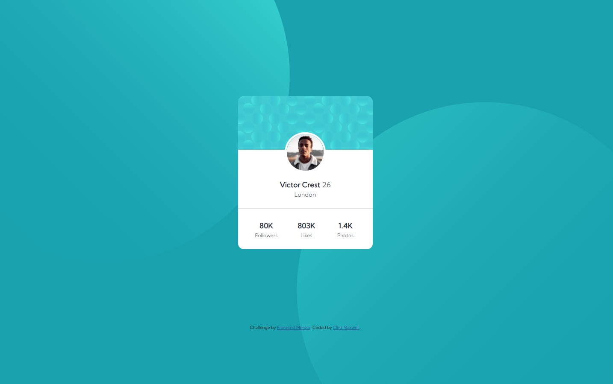
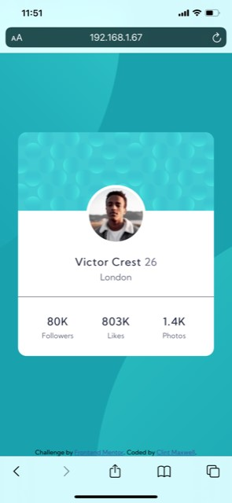

# Frontend Mentor - Profile card component solution

This is a solution to the [Profile card component challenge on Frontend Mentor](https://www.frontendmentor.io/challenges/profile-card-component-cfArpWshJ). Frontend Mentor challenges help you improve your coding skills by building realistic projects. 

## Table of contents

- [Overview](#overview)
  - [The challenge](#the-challenge)
  - [Screenshots](#screenshot)
  - [Links](#links)
- [My process](#my-process)
  - [Built with](#built-with)
  - [What I learned](#what-i-learned)
  - [Continued development](#continued-development)
  - [Useful resources](#useful-resources)
- [Author](#author)
- [Acknowledgments](#acknowledgments)

## Overview

### The challenge

- Build out the project to the designs provided

### Screenshots
#### Desktop


#### Mobile


### Links

- Solution URL: [Responsive Page Using CSS Grid and Flexbox](https://www.frontendmentor.io/solutions/responsive-page-using-css-grid-and-flexbox-SzGKs88IW)
- Live Site URL: [Profile Card Component](https://antoniohoutx.github.io/profile-card-component-main/index.html)

## My process

### Built with

- Semantic HTML5 markup
- CSS custom properties
- Flexbox
- CSS Grid
- Mobile-first workflow

### What I learned

One of the things I learned while working on this project was positioning of background .svg images.  There were two images that required a bit of time to manipulate in order to get them positioned just right in both the mobile and desktop versions of this project, as demonstrated in the following code snipets:

To see how you can add code snippets, see below:

```css
body {
  background-color: hsl(185, 75%, 39%); /* Dark Cyan */
  background-image: url("images/bg-pattern-top.svg"), url("images/bg-pattern-bottom.svg");
  background-position: -35% 250%, 125% -225%;
  background-repeat: no-repeat;
  font-family: "Kumbh Sans";
  text-align: center;
}
```
```css
@media only screen and (max-width: 768px) /* mobile version */ {
  body {
    background-color: hsl(185, 75%, 39%); /* Dark Cyan */
    background-image: url("images/bg-pattern-top.svg"), url("images/bg-pattern-bottom.svg");
    background-position: 135% 250%, -30% -180%;
    background-repeat: no-repeat;
    font-family: "Kumbh Sans";
    text-align: center;
  }
}
```
### Continued development

Areas in which I would like to continue to focus on in future projects include CSS Grid and Flexbox.  These still are problematic for me, however I am confident that with additional practice I will only improve.
### Useful resources

- [W3 Schools](https://www.w3schools.com/default.asp) - As always, their HTML/CSS reference guides are an invaluable resource to anyone who is learning the finer points of HTML & CSS.
## Author

- Frontend Mentor - [@AntonioHouTX](https://www.frontendmentor.io/profile/AntonioHouTX)
- Twitter - [@clintmaxwell](https://www.twitter.com/clintmaxwell)
- LinkedIn - [Clint Maxwell](https://www.linkedin.com/in/maxwellclint/)
## Acknowledgments

Special thanks to [Drull](https://github.com/drull1000) and [Grace Snow](https://github.com/grace-snow) for their continued patience and time spent guiding me on the finer points of HTML and CSS while working on this project.  
